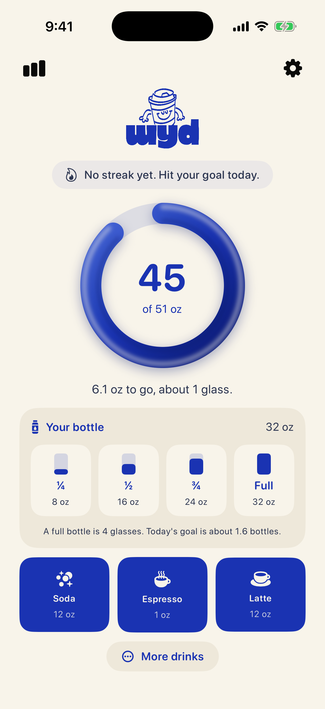

# Wyd - What're You Drinking?

A hydration tracker for iOS. It sets your daily goal from your body and the
weather, counts the bottle you already sip from, and credits each drink for
what it actually contributes.

<p align="center">
  
</p>

## Features

**Logging**

- **Progress ring** fills toward today's goal and says how many ounces and
  glasses are left.
- **Your bottle** logs a quarter, half, three quarters or all of the bottle you
  refill through the day, and shows today's goal in bottles. The size is
  adjustable from 8 to 128 oz.
- **Quick drink tiles** put your three most common drinks one tap away. Pick
  and reorder them in Settings, or long-press a tile. Choosing a fourth
  replaces whichever you picked longest ago.
- **More drinks** covers 15 drinks across hot, cold, energy and sport, and
  alcohol. Drinks that cost more fluid than they give show the net loss before
  you tap.
- **Drink sizes** can be edited per drink, so a tap logs what you actually
  pour.
- **Undo and Reset Today** sit below the fold, where they are a deliberate
  reach rather than something to hit while logging.

**Goal**

- **Automatic goal** from weight, age, sex and activity level, or a manual goal
  from 16 to 170 oz.
- **Heat allowance** raises the goal on hot or humid days, and the home screen
  says why: "Austin feels like 104°F, so today's goal is up 25 oz".

**Progress**

- **Streak** of consecutive days at goal. Today only counts once you hit it, so
  an unfinished day never reads as a broken streak.
- **History** shows your streak and average intake, a curve of the last seven
  days against the goal line, and a month calendar where each day is filled to
  how close you got.
- **Day detail** opens from any calendar day: every drink with its time, its
  size, and what it counted for.

**Reminders**

- **1 to 12 reminders a day**, spaced evenly between a start and end hour you
  choose. Each hour has its own message, so six reminders never read as one
  alert repeating.

## How the goal works

- **Body baseline** from weight, age, sex and activity level, rounded to the
  nearest 50 ml.
- **Heat allowance** on top, driven by the *heat index* rather than the
  thermometer. Humid air blocks evaporative cooling, so a 91°F day at 65%
  humidity works the body like 104°F. The allowance steps from 8 oz at a heat
  index of 81°F up to 34 oz at 113°F. Weather comes from Open-Meteo, which needs
  no API key, and is rechecked at most every 30 minutes.

## How drinks count

Most drinks scale with volume: milk counts for more than water (its protein and
electrolytes slow gastric emptying, so more fluid is retained), soda counts for
less. Alcohol is different - its diuretic cost tracks the alcohol rather than
the liquid, so a spirit goes backwards while a beer still nets out positive.

These are rough guides, not medical advice.

## How data is stored

Everything stays on the phone. There is no account, no server of Wyd's own and
no analytics.

- **Logged days** live in SwiftData, Apple's on-device database. Each day is one
  row keyed by its date, holding that day's intake, its goal and whether the
  goal was met. Its drinks hang off it as separate rows: the drink, its volume,
  the time, and whether it came from your bottle.
- **What a drink was credited is stored with it**, not recalculated. If a
  drink's hydration factor changes in a later version, past days keep showing
  what they counted at the time. Each day keeps its own goal for the same
  reason.
- **Settings** (your body profile, goal mode, bottle size, drink sizes, quick
  drinks and reminder schedule) are a handful of values, kept in
  `UserDefaults`.
- **Units**: everything is stored in millilitres, kilograms and centimetres,
  and converted to ounces, pounds and inches only for display.
- **Network**: the only request Wyd makes is for weather. It sends your
  coordinates, rounded to about 100 m, to Open-Meteo, and uses Apple's
  geocoder for the city name. Location is requested only while the app is open,
  and neither the location nor the weather is saved.
- **Backups and sync**: data is included in normal iPhone backups but does not
  sync between devices. Deleting the app deletes it. Reinstalling over the top,
  as the install script does, keeps it.

If the database ever fails to open, Wyd falls back to an in-memory store rather
than crashing on launch. That day's logging would be lost on quit, which is
bad, but an app that cannot open at all is worse.

## Building

The Xcode project is generated from `project.yml`, so it is not committed.

```
brew install xcodegen
xcodegen generate
open WaterTracker.xcodeproj
```

Requires iOS 17 or later.

## Running it on a phone

```
./scripts/install-on-phone.sh
```

Plug the phone in and unlock it first. The script finds the device, builds,
signs and installs.

A free Apple ID signs apps for seven days, so Wyd stops opening after a week.
The app is never removed and neither is anything you logged, since the history
lives in the app's own database; only the signature expires. Run the script
again to renew it. The Apple Developer Program lifts this to a year, and brings
TestFlight with it, which is the only practical way onto someone else's phone.

`project.yml` carries a `DEVELOPMENT_TEAM`. Building on another machine means
replacing it with that machine's own team.
